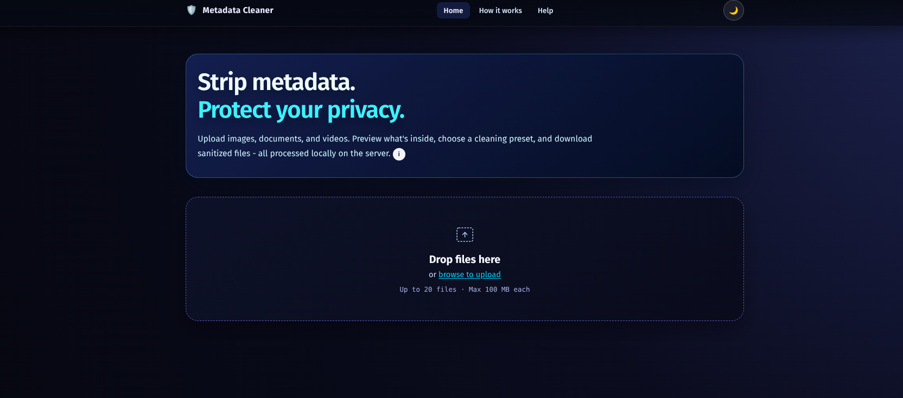
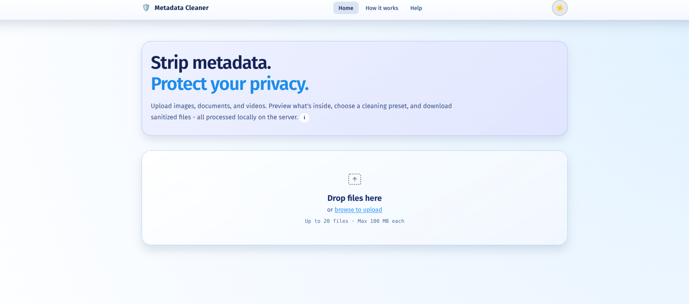
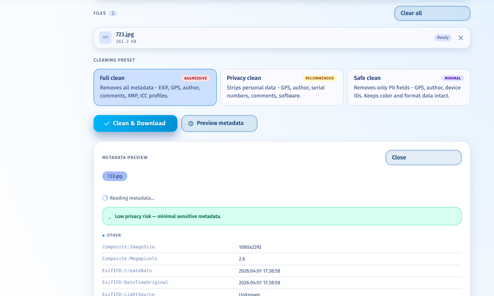
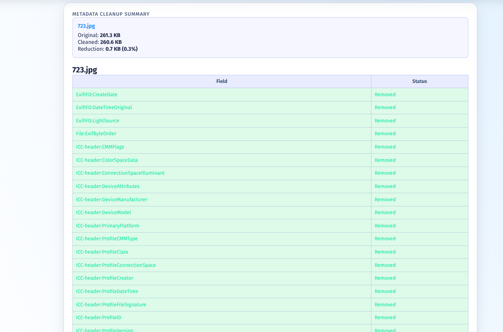
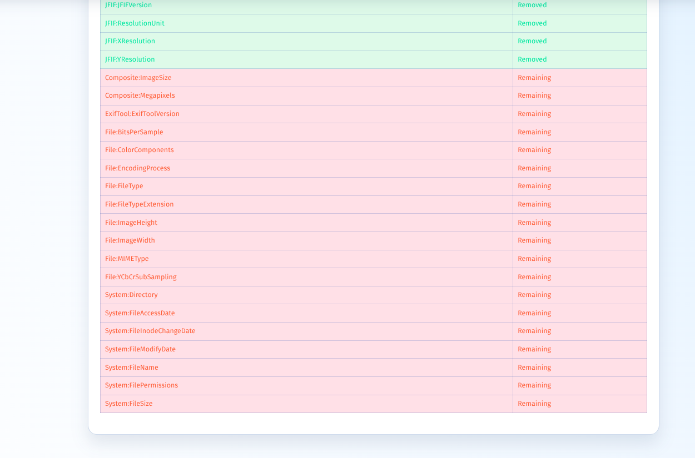

# Metadata Cleaner

A privacy-focused Flask application for stripping sensitive metadata from images, documents, and videos using ExifTool.

## Features

- Drag-and-drop multi-file upload (up to 20 files, 100 MB each by default)
- Live metadata preview with risk scoring before you clean
- Three cleaning presets: Full, Privacy, and Safe
- Grouped metadata display by category (GPS, Author, Device, Software, etc.)
- Batch download as ZIP for multiple files
- REST API at `/api/v1/` for programmatic access
- Zero retention: all files deleted immediately after download
- Dark, accessible UI - mobile-friendly

## Requirements

- Python 3.11+
- ExifTool installed and on your system PATH

### Install ExifTool

```bash
# Ubuntu / Debian
sudo apt update && sudo apt install libimage-exiftool-perl

# macOS
brew install exiftool

# Windows
# Download from https://exiftool.org/ and add to PATH
```

## Installation

```bash
git clone <repo-url>
cd metadata-cleaner

python -m venv .venv
source .venv/bin/activate       # Windows: .venv\Scripts\activate

pip install -r requirements.txt

cp .env.example .env
# Edit .env with your settings
```

## Running

### Development

```bash
FLASK_DEBUG=true python run.py
```

Open `http://localhost:5000`

### Production (gunicorn)

```bash
gunicorn "run:app" --workers 4 --bind 0.0.0.0:5000
```

### Production (waitress, Windows)

```bash
pip install waitress
waitress-serve --port=5000 run:app
```

## Configuration

All settings are controlled via environment variables. See `.env.example` for the full list.

| Variable | Default | Description |
|---|---|---|
| `SECRET_KEY` | `dev-secret-...` | Flask secret key - change in production |
| `MAX_FILES` | `20` | Max files per batch |
| `MAX_FILE_SIZE_MB` | `100` | Max size per file in MB |
| `SESSION_TTL_MINUTES` | `30` | Auto-cleanup TTL for temp files |
| `UPLOAD_BASE_DIR` | `/tmp/metadata_cleaner_uploads` | Temp upload directory |
| `PAGE_TITLE` | `Metadata Cleaner` | Browser/header title |
| `EXIFTOOL_PATH` | auto-detect | Full path to exiftool binary |
| `DOMAIN_URL` | `https://yoursite.com` | Base app URL for sitemap and canonical tags |
| `SITEMAP_LAST_MODIFIED` | `<today>` | Sitemap `<lastmod>` default (ISO date) |

## SEO / Search Engine Setup

This project includes SEO-friendly defaults:

- `robots.txt` served at `/robots.txt` (see `app/static/robots.txt`)
- `sitemap.xml` served at `/sitemap.xml` (see `app/routes/main.py`)
- dynamic meta tags in `app/templates/base.html` (title, description, OG, Twitter)
- JSON-LD schema support (WebApplication)

### Recommended steps after deployment

1. Set `DOMAIN_URL` in `.env` to your site URL.
2. Verify `robots.txt` is accessible: `https://yourdomain.com/robots.txt`.
3. Verify `sitemap.xml` is accessible: `https://yourdomain.com/sitemap.xml`.
4. Submit sitemap URL to Google Search Console and Bing Webmaster Tools.


## API

```bash
# Check supported file types
GET /api/v1/supported-types

# List cleaning presets
GET /api/v1/presets

# Extract metadata from a file
POST /api/v1/metadata
Content-Type: multipart/form-data
Body: file=<file>

# Validate a preset
POST /api/v1/validate-preset
Content-Type: application/json
Body: {"preset": "custom", "fields": ["Author", "GPSLatitude"]}
```

## Utility endpoints

```bash
# Health check
GET /health

# Sitemap for search engines
GET /sitemap.xml

# Robots file for crawlers
GET /robots.txt
```

## Cleaning Presets

| Preset | What it removes |
|---|---|
| `full` | Everything - all EXIF, XMP, ICC, IPTC |
| `privacy` | GPS, author, serial numbers, comments, software tags |
| `safe` | GPS and author/identity fields only |
| `custom` | Your specified list of fields |
## Visual Preview (Screenshots)

Add the following screenshots to help users quickly understand the UI:

1. `screenshots/dark-mode.png` - Dark mode interface
2. `screenshots/light-mode.png` - Light mode interface
3. `screenshots/metadata-preview.png` - Metadata preview pane
4. `screenshots/cleanup-summary1.png` - Cleanup result summary and comparison
5. `screenshots/cleanup-summary2.png` - Cleanup result summary and comparison

### Screenshots

#### Dark Mode


#### Light Mode


#### Metadata Preview


#### Cleanup Summary 1


#### Cleanup Summary 2


## Project Structure

```
metadata-cleaner/
├── run.py                      # Entry point
├── requirements.txt
├── .env.example
├── robots.txt                  # Publication root robots policy
└── app/
    ├── __init__.py             # Application factory
    ├── config.py               # All configuration
    ├── routes/
    │   ├── main.py             # UI pages + /sitemap.xml + /robots.txt + health
    │   ├── metadata.py         # POST /get_metadata
    │   ├── clean.py            # POST /process_files
    │   └── api.py              # /api/v1/* REST endpoints
    ├── services/
    │   ├── exiftool.py         # ExifTool subprocess wrapper
    │   ├── metadata.py         # Filtering, categorization, risk scoring
    │   └── cleaner.py          # Orchestrates clean + diff
    ├── utils/
    │   ├── validators.py       # Upload validation
    │   └── file_utils.py       # Session directories, zip, cleanup
    ├── templates/
    │   ├── base.html
    │   ├── upload.html
    │   ├── how-it-works.html
    │   ├── help.html
    │   └── error.html
    └── static/
        ├── css/main.css
        ├── js/upload.js
        └── robots.txt
```

## Security Notes

- Filenames are sanitized with `werkzeug.utils.secure_filename` before saving
- File size is checked before writing to disk
- Temp directories are UUID-scoped and removed after each request
- `MAX_CONTENT_LENGTH` enforced at the Flask layer to reject oversized requests
- No files are ever accessible via a public URL - only served via `send_file`
